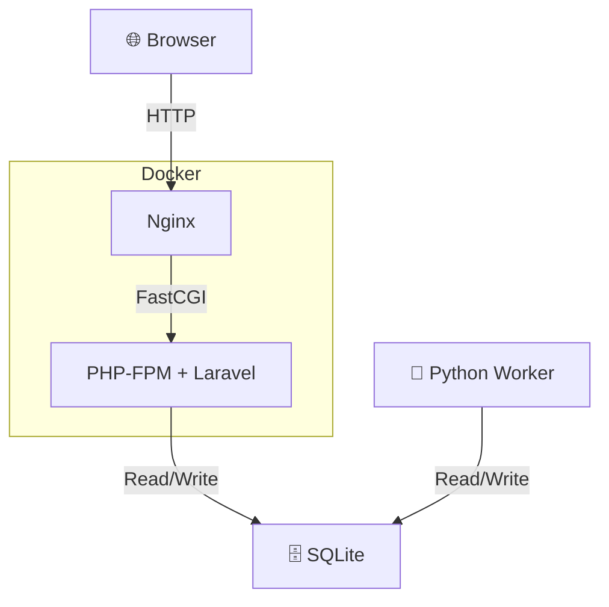
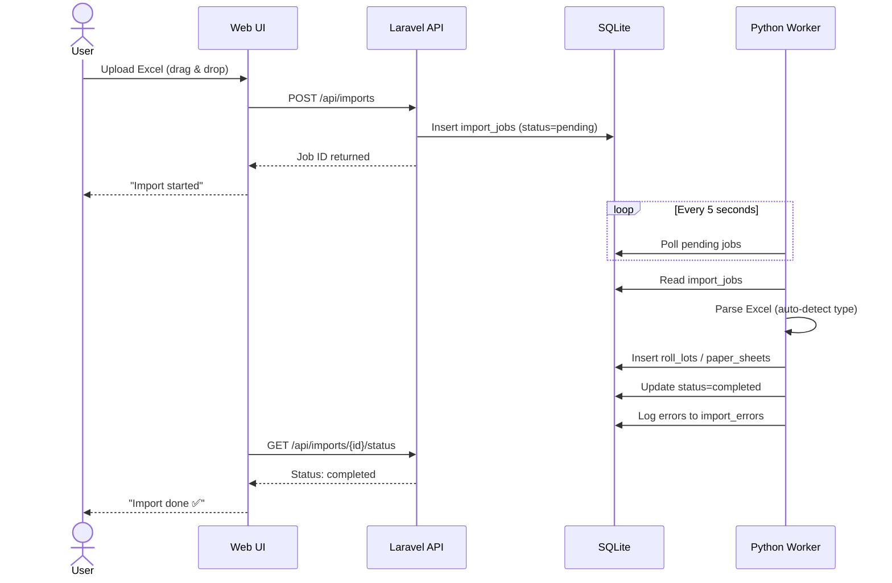
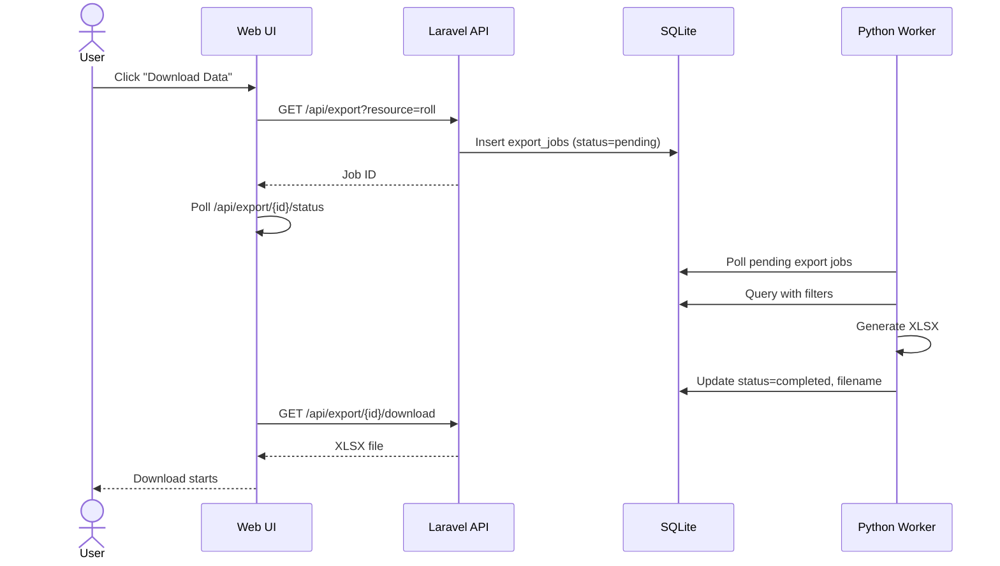
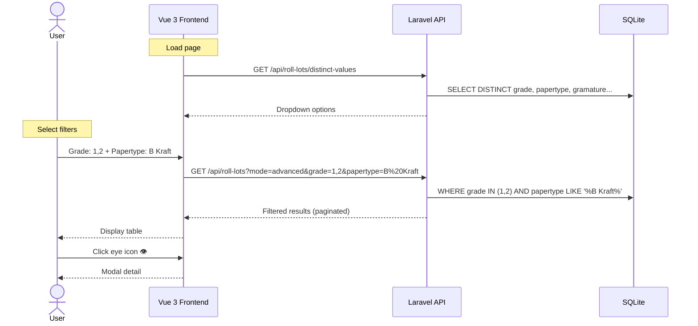

# Roll Lot Viewer

Aplikasi internal untuk mengimpor, menampilkan, dan memfilter data mutasi kertas produksi.

**Dua tipe data:**
- **Mutasi Roll (PM1/PM2):** Data roll/lot harian dari `PeriodBalanceRoll.xlsx`
- **Mutasi Stock Sheet:** Data stock sheet harian (format kolom berbeda, auto-detect)

## Tech Stack
- **Backend:** Laravel 11 (PHP 8.3+)
- **Frontend:** Vue 3 (Composition API) + Vite
- **Database:** SQLite
- **Worker:** Python 3 (background import/export via systemd)
- **Server:** Nginx + PHP-FPM (Docker)

## Architecture



## Workflow

### Import Flow



### Export Flow



### Search & Filter Flow



## Quick Start

### 1. Clone & Install
```bash
git clone git@github.com:andrizpray/roll_lot_viewer.git
cd roll_lot_viewer
composer install
cp .env.example .env
php artisan key:generate
```

### 2. Database Setup (SQLite)
```bash
touch database/database.sqlite
php artisan migrate
```

### 3. Build Frontend
```bash
npm install && npm run build
```

### 4. Start Services
```bash
# Laravel
php artisan serve --host=0.0.0.0 --port=8000

# Python Worker
sudo systemctl start roll-lot-worker
```

## Fitur

### Import
- Upload Excel via Web UI (drag & drop)
- **Auto-detect tipe file** — deteksi dari header kolom (Roll atau Sheet)
- **Mutasi Roll** — Parsing kolom Description → Papertype, Gramature, Playbond, Width
- **Mutasi Stock Sheet** — Parsing Description → Gramature & Dimension
- Snapshot history setiap kali re-import roll
- Sheet data bersifat **append** (tidak replace)
- Error logging per baris yang gagal diparse

### Tampilan Data

**Data Roll** (`/`)
- Tabel: LotID, ItemID, Weight, RewID, Papertype, Gramature, Width, Grade, Diameter
- **Mode Batch:** Paste banyak LotID sekaligus (comma, newline, semicolon)
- **Mode Advanced:** Filter per ItemID, Grade (multi-select), Papertype, Gramature, Width, Date range

**Data Sheet** (`/sheets`)
- Tabel: LotID, ItemID, Weight, Papertype, Gramature, Dimension, Content Pack, Content Pallet
- Mode Batch & Advanced filter

### Export
- Download hasil filter sebagai **XLSX**
- Export async via Python worker

### UX
- Loading skeleton shimmer
- Modal detail per row (ikon mata 👁)
- Multi-select grade filter dengan tags
- Notifikasi LotID tidak ditemukan

## API Endpoints

| Method | URL | Description |
|--------|-----|-------------|
| POST | `/api/imports` | Upload Excel file |
| GET | `/api/imports` | List import history |
| GET | `/api/imports/{id}` | Import batch detail |
| GET | `/api/roll-lots?mode=batch&lot_ids=...` | Batch search (Roll) |
| GET | `/api/roll-lots?mode=advanced&grade=1,2` | Advanced filter (Roll) |
| GET | `/api/roll-lots/distinct-values` | Filter dropdown values |
| GET | `/api/roll-lots/{id}` | Single roll lot detail |
| GET | `/api/sheets?mode=batch&lot_ids=...` | Batch search (Sheet) |
| GET | `/api/sheets?mode=advanced&...` | Advanced filter (Sheet) |
| GET | `/api/sheets/distinct-values` | Filter dropdown values |
| GET | `/api/sheets/{id}` | Single sheet detail |
| GET | `/api/export?resource=roll` | Create export job |
| GET | `/api/export/{id}/status` | Poll export status |
| GET | `/api/export/{id}/download` | Download XLSX |
| GET | `/api/dashboard` | Dashboard summary |

## Database

| Tabel | Fungsi |
|-------|--------|
| `roll_lots` | Data mutasi roll aktif |
| `roll_lot_histories` | Snapshot roll sebelum replace |
| `paper_sheets` | Data mutasi stock sheet |
| `import_batches` | Log setiap import |
| `import_jobs` | Async import jobs |
| `export_jobs` | Async export jobs |
| `import_errors` | Baris gagal import |

## Python Worker

Background worker yang menggantikan Laravel queue:

```bash
# Start
sudo systemctl start roll-lot-worker

# Logs
journalctl -u roll-lot-worker -f
```

Worker poll setiap 5 detik:
- `import_jobs` (status=pending) → proses Excel import
- `export_jobs` (status=pending) → generate XLSX export

## Performance

Dengan optimasi:
- **PHP OPcache** (128MB, JIT 64MB)
- **Laravel cache** (config, route, view, event)
- **SQLite WAL mode** + busy_timeout
- **Nginx gzip** + static asset cache

Response time: **~90ms** per endpoint
