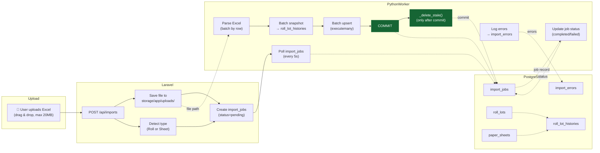

# Roll Lot Viewer

Aplikasi internal untuk mengimpor, menampilkan, dan memfilter data mutasi kertas produksi.

**Dua tipe data:**
- **Mutasi Roll (PM1/PM2):** Data roll/lot harian dari `PeriodBalanceRoll.xlsx`
- **Mutasi Stock Sheet:** Data stock sheet harian (format kolom berbeda, auto-detect)

## Tech Stack

| Layer | Teknologi |
|-------|-----------|
| Backend | Laravel 13 (PHP 8.3+) |
| Frontend | Vue 3 (Composition API) + Vite + PrimeVue 4 + Tailwind CSS 4 |
| Database | PostgreSQL (Laravel & Python worker — single source of truth) |
| Worker | Python 3 + openpyxl + psycopg2 (background import/export via polling) |
| Auth | API Key middleware (`X-API-Key` header) |
| Server | Nginx + Cloudflare Tunnel |

## Architecture


```mermaid
flowchart LR
    subgraph Upload
        U["👤 User uploads Excel\n(drag & drop, max 20MB)"]
    end

    subgraph Laravel
        A1["POST /api/imports"]
        A2["Detect type\n(Roll or Sheet)"]
        A3["Create import_jobs\n(status=pending)"]
        A4["Save file to\nstorage/app/uploads/"]
    end

    subgraph PostgreSQL
        IJ["import_jobs"]
        RL["roll_lots"]
        PS["paper_sheets"]
        RH["roll_lot_histories"]
        IE["import_errors"]
    end

    subgraph PythonWorker
        W1["Poll import_jobs\n(every 5s)"]
        W2["Parse Excel\n(batch by row)"]
        W3["Batch snapshot\n→ roll_lot_histories"]
        W4["Batch upsert\n(executemany)"]
        W5["COMMIT"]
        W6["_delete_stale()\n(only after commit)"]
        W7["Log errors\n→ import_errors"]
        W8["Update job status\n(completed/failed)"]
    end

    U --> A1 --> A4 & A2 --> A3 --> W1
    A4 -. file path .-> W2
    W1 -.-> IJ
    W2 --> W3 --> W4 --> W5 --> W6
    W5 -.-> IJ
    W6 -. commit .-> IJ
    RL & PS -.-> RH
    W7 -. errors .-> IE
    W8 -. status .-> IJ
    IJ -. job record .-> W8

    style W5 fill:#166534,color:#fff,stroke:#166534
    style W6 fill:#166534,color:#fff,stroke:#166534
```

## Workflow

### Import Flow

1. User upload Excel via Web UI (drag & drop, max 20MB)
2. Laravel `POST /api/imports` → simpan file → detect tipe dari header → insert `import_jobs` (status=pending)
3. Python worker poll → batch parse Excel → **batch snapshot** ke `roll_lot_histories` → **batch upsert** (per 1000 row/chunk) → log errors per baris
4. `_delete_stale()` dijalankan **hanya setelah commit berhasil** — file kosong tidak menghapus data
5. Frontend poll status sampai completed

### Export Flow

1. User klik "Download Data" dengan filter aktif
2. Laravel `GET /api/export` → insert `export_jobs` (status=pending)
3. Python worker poll → query → generate XLSX (max 10.000 baris) → update status=completed
4. Frontend download file via `/api/export/{id}/download`

## Quick Start

### 1. Clone & Install

```bash
git clone git@github.com:andrizpray/roll_lot_viewer.git
cd roll_lot_viewer
composer install
cp .env.example .env
php artisan key:generate
```

### 2. Konfigurasi `.env`

```bash
# Wajib di production:
API_KEY=your-random-secret-key-here

# PostgreSQL (default):
DB_CONNECTION=pgsql
DB_HOST=127.0.0.1
DB_PORT=5432
DB_DATABASE=roll_lot_viewer
DB_USERNAME=roll_lot_user
DB_PASSWORD=
```

### 3. Database Setup

```bash
# Buat database dan user (PostgreSQL):
createdb -U postgres roll_lot_viewer
psql -U postgres -d roll_lot_viewer -c "CREATE USER roll_lot_user WITH PASSWORD 'your_password';"
psql -U postgres -d roll_lot_viewer -c "GRANT ALL PRIVILEGES ON DATABASE roll_lot_viewer TO roll_lot_user;"
psql -U postgres -d roll_lot_viewer -c "GRANT ALL ON SCHEMA public TO roll_lot_user;"

# Update .env: DB_PASSWORD=your_password

# Run migrations:
php artisan migrate
```

### 4. Build Frontend

```bash
npm install && npm run build
```

### 5. Start Services

```bash
# Laravel (port 8080):
php artisan serve --host=0.0.0.0 --port=8080

# Python Worker:
cd python && python3 main.py

# atau via PM2:
pm2 start python/main.py --name roll-lot-worker
```

## Autentikasi API

Semua endpoint API dilindungi oleh API key. Kirim key via:
- Header: `X-API-Key: <key>`
- Query param: `?api_key=<key>`

Di environment `local`/`testing` tanpa `API_KEY` dikonfigurasi, auth dilewati otomatis.

## Fitur

### Import
- Upload Excel via Web UI (drag & drop, max 20MB)
- **Auto-detect tipe file** — deteksi dari header kolom (Roll atau Sheet)
- **Batch upsert** — 1 koneksi per job, chunk 1000 row, satu transaksi
- **Batch snapshot history** — 1 SELECT + 1 INSERT per job (bukan per baris)
- **Empty file guard** — file kosong tidak menghapus data existing
- **Error logging** — baris gagal dicatat ke `import_errors` dengan row number dan alasan

### Tampilan Data

**Data Roll** (`/rolls`)
- Tabel: LotID, ItemID, Weight, RewID, Papertype, Gramature, Width, Grade, Diameter
- **Mode Batch:** Paste banyak LotID sekaligus (comma, newline, semicolon, tab, space), max 1000
- **Mode Advanced:** Filter per ItemID, Grade (multi-select), Papertype, Gramature, Width, Date range
- Color-coded grade badges

**Data Sheet** (`/sheets`)
- Tabel: LotID, ItemID, Weight, Papertype, Gramature, Dimension, Content Pack, Content Pallet
- Mode Batch & Advanced filter

**Dashboard** (`/`)
- Summary: total roll lots, total sheets, total imports (success/fail)
- Bar chart: aktivitas import 7 hari terakhir
- Recent imports list

### Export
- Download hasil filter sebagai **XLSX** (max 10.000 baris)
- Grade 3 rows di-highlight kuning
- Async via Python worker

### UX
- **Dark theme** dengan emerald accent
- **Responsive sidebar** navigation
- Loading skeleton shimmer
- Modal detail per row (ikon mata)
- Multi-select grade filter dengan tags
- Notifikasi LotID tidak ditemukan (batch mode)

## API Endpoints

Semua endpoint memerlukan `X-API-Key` header (kecuali di local env).

| Method | URL | Description |
|--------|-----|-------------|
| GET | `/health` | Health check endpoint |
| GET | `/api/dashboard` | Dashboard summary |
| POST | `/api/imports` | Upload Excel file |
| GET | `/api/imports` | List import jobs |
| GET | `/api/imports/{id}` | Import job detail |
| GET | `/api/imports/{id}/status` | Poll import status |
| GET | `/api/imports/templates/roll` | Download Roll template |
| GET | `/api/imports/templates/sheet` | Download Sheet template |
| GET | `/api/roll-lots?mode=batch&lot_ids=...` | Batch search (Roll) |
| GET | `/api/roll-lots?mode=advanced&grade=1,2` | Advanced filter (Roll) |
| GET | `/api/roll-lots/distinct-values` | Filter dropdown values |
| GET | `/api/roll-lots/{id}` | Single roll lot detail |
| GET | `/api/sheets?mode=batch&lot_ids=...` | Batch search (Sheet) |
| GET | `/api/sheets?mode=advanced&...` | Advanced filter (Sheet) |
| GET | `/api/sheets/distinct-values` | Filter dropdown values |
| GET | `/api/sheets/{id}` | Single sheet detail |
| GET | `/api/export?resource=roll` | Create export job |
| GET | `/api/export/{id}/status` | Poll export status |
| GET | `/api/export/{id}/download` | Download XLSX |

## Database

| Tabel | Fungsi |
|-------|--------|
| `roll_lots` | Data mutasi roll aktif |
| `roll_lot_histories` | Snapshot roll sebelum re-import (arsip) |
| `paper_sheets` | Data mutasi stock sheet |
| `import_jobs` | Async import jobs (diproses Python worker) |
| `import_errors` | Baris gagal import (per row) |
| `export_jobs` | Async export jobs (diproses Python worker) |

## Python Worker

Background worker — polling setiap 5 detik:

```
import_jobs (status=pending)
  → parse Excel headers → detect type
  → batch snapshot (roll_lot_histories)
  → batch upsert (executemany, chunk 1000)
  → _delete_stale() AFTER commit
  → log errors per baris

export_jobs (status=pending)
  → query with filters
  → generate XLSX (openpyxl)
  → update status=completed
```

Config: `python/config.py`

```bash
# Start manual
cd python && python3 main.py

# Via PM2
pm2 start python/main.py --name roll-lot-worker
pm2 logs roll-lot-worker

# Via systemd
sudo systemctl start roll-lot-worker
sudo systemctl status roll-lot-worker
journalctl -u roll-lot-worker -f
```

## UI Components

| Component | Fungsi |
|-----------|--------|
| AppNavbar | Top navigation bar |
| AppSidebar | Side navigation |
| DefaultLayout | Layout wrapper |
| DashboardPage | Dashboard dengan charts |
| HomePage | Roll lots data table + filter |
| SheetPage | Paper sheets data table + filter |
| UploadPage | File upload dengan drag & drop |
| DetailModal | Modal detail per roll |
| SheetDetailModal | Modal detail per sheet |
| ImportBatchModal | Modal history import |

## Performance

- **PostgreSQL** ( bukan SQLite — mendukung concurrent connections lebih baik)
- **Batch executemany** — 1 koneksi per job, bukan per baris
- **Batch snapshot** — 1 SELECT + 1 INSERT per job untuk history
- **PHP OPcache** + JIT
- **Laravel cache** (config, route, view)
- **Nginx gzip** + static asset cache

## Systemd Services

```bash
sudo systemctl status roll-lot-viewer   # Laravel
sudo systemctl status roll-lot-worker   # Python worker
sudo systemctl status cloudflared       # Cloudflare tunnel
sudo systemctl status nginx            # Reverse proxy
```

## Live Demo

https://lot-viewer.driz.web.id

## License

Internal use only.
